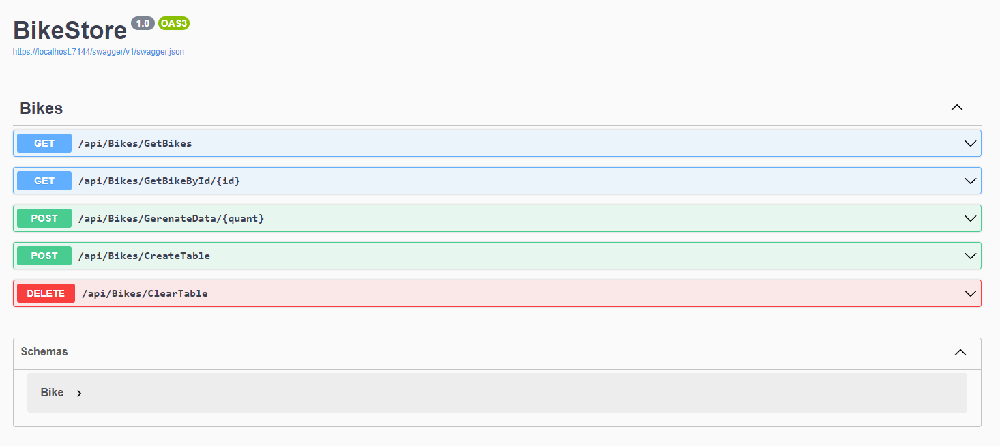

<h1 align="center">Email Sender com Workers</h1>

## 💻 Projeto

Projeto de API em .NET 6 com o objetivo de testar a latência da extração de dados via Dapper em uma base de dados SQL Server, comparando-o com a extração de dados via Cache do Redis.

<p align="center">
  
</p>
<p align="center">Source: Criado pelo autor</p>

## ⚙️ Tecnologias
- .NET 6
- Redis (v6.1.0)
- SQL Server (v.6.0.16)
- Dapper (v2.0.123)
- Swagger (v6.5.0)

## 🛠️ Ferramentas
- Microsoft Visual Code
- Docker Desktop
- Fork + Git Bash
- Postman
- SQL Server Management Studio 19
- Another Redis Desktop Manager

## ✅ Como testar
Necessário criar um server local para SQL e um database com nome "BikeStore". Configurações adicionais podem ser alteradas no appsettings.json

Inicialização da imagem do redis (na pasta raiz do projeto). A porta padrão é a 6378.
```
docker-compose up -d
```
Dentro do Another Redis Desktop Manager, aplicativo de gerenciamento do Redis, é possível examinar as chaves e valores criados.

## :memo: Licença

Esse projeto está sob a licença MIT.
